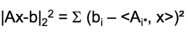
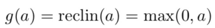

# 大数据分析简介
- 难组织、难获取、难处理、难理解
- 定义：在可容忍的时间内，无法用传统IT架构和软硬件工具对其进行全生命周期的感知、传输、存储、管理、计算和服务的数据集合
- 人、机、物三元世界：信息世界、物理世界、人类社会
- 特征：5V
    volume、velocity、variety、veracity、value
  
- 四层次：描述性分析（统计）、诊断性分析、预测性分析（机器学习）、指导性分析（人工智能）

# 大数据分析技术与系统
- 可扩展算法：
A：多项式时间算法

当常数c>0, A可扩展；c=0，A为线性可扩展
    - 数据分析算法：以优化为中心  
    多轮迭代直至收敛  
    算法目标为最优：没有确定答案(最优点往往无法达到)  
    随机梯度下降SGD  
    数据并行+模型并行
    
    - 传统算法：以操作为中心  
    确定性算法   
    目标为正确答案：有一个或者多个确定的答案
<ul>参数更新
<li>同步更新BSP：每一轮迭代至少一个同步点，结果准确，慢
<li>异步更新ASP
    <ol><li> 参数互相依赖
        <li> 参数过期
    </ol>
<li>半同步更新SSP:比同步快，比异步更加准确

## MapReduce
- Map --(key, value)  
    hash获得唯一key  
    读取输入并产生键值对
- Group by  
    对键值对排序和洗牌，给定key的键值对送到相同的reduce
- Reduce  
    将按key分组的键值对生成新的键值对  
例：word count  
    文档word：key; 次数：value
- 开销测量  
    总通信开销：输入文件大小+2x(Map发送到Reduce+Redece处理的文件大小)  
    经过的开销：Map+Redece输入/输出的文件规模和

# 大数据统计分析
## 相关性分析
### 传统相关性分析：
- 皮尔森系数：  随机变量X, Y   
协方差/标准差
- 斯皮尔曼系数：
ri,si为Xi,Yi的秩  //秩之间的皮尔森相关系数，一个关注值、一个关注序  
以上两个必须有序
- 肯德尔系数：
- 互信息：
- 基于矩阵：RV系数
- 基于距离：to 向量

# 相似文档大图
## shingling：  
k-shingle/k-gram:文档中k个单词组成的序列  
文档转换成集合  
    - Jaccard相似度：
集合->布尔矩阵：行：shingle元素e；列：文档s；
## Min-hashing 
//最小哈希
以随机扰动对矩阵进行重排  
不同哈希函数多次对0/1矩阵随机扰动
## LSH
寻找jaccard相似度至少为 s 的文档对
- Band partition  
    划分签名矩阵为 b 个段，每一个段有 r 行   
    对每个band, 将每列的一部分(r rows)散列到具有 k 个桶的散列表中  
    （对候选对）至少有一个band被散列到同一个桶  
example：

### Count Min Sketch
- Sketch: d*w的矩阵：d个hash函数，每个hash一行
- 查询Query: 获取最小计数值

## 回归分析
- 线性回归
- 矩阵形式--最小二乘方法
令 r < n，并假设从要指定的矩阵的某种分布中选择一个 r × n 随机矩阵S
<ol>
<li>对随机矩阵 S 进行采样。<li>
计算 S·A 和 S·b。
<li>输出回归问题minx ‖(SA)x − (Sb)‖2 的精确解x。

# 大数据机器学习
## 降维：目的是寻找数据的轴
<ul>
<li>发现隐含的关联、主题
<li>移除冗余的、有噪声的特征
<li>数据的解释、可视化
<li>方便数据的存储和处理

### SVD
- 最小化重构误差

## 决策树  
若 xi < threshold，选择左子树  
若 xi ≥ threshold，选择右子树
训练慢、预测快
- 熵最大准则  

- 熵平均  
  
- 信息增益最大化：  

### 回归树
叶节点赋值  

## 随机森林
对每棵树，采样一个数据子集 Si 和特征子集 Di 用来训练  
预测: 取T棵树的结果的平均
采用加权平均或投票表决

## GBDT
- 每个学习器是一个决策树
- 每个回归树近似于函数梯度 

加权累加

## 神经网络
- 激活函数：  
    sigmoid:  

    ReLU:

- 梯度衰减；经验风险最小化；L1正则；L2正则

- 随机失活dropout：  
随机移除隐藏层单元削弱神经网络
- 随机梯度下降

- 模型选择：
    训练集、验证集、测试集
- 早停：验证集错误增加时停止训练
- mini-batch
- 拟正则化Batch Normalization：  
解决非线性激励层对输入的敏感度
- Momentum动量：  
使用之前梯度的指数平均

# 数据驱动的自然语言处理
## 语法分析
### 词法分析
- 词性标注：消除词性兼类歧义
- 中文分词：难点：歧义切分：交集型/组合型      
    LSTM：RNN:短时记忆问题+梯度消失问题
    - 结构：内部状态向量c、输出向量h；  
            遗忘门、输入门、输出门    

- sigmoid门控：
- 遗忘门：前一单元的输出信息ℎt-1与当前输入信息𝑥t同时传递到sigmoid函数  

- 输入门：<ol><li>对前一单元的输出ℎt-1与当前单元的输入𝑥t的拼接做非线性tanh变换，得到新的输入向量 <li>前一单元的输出ℎt-1与当前单元的输入𝑥t拼接并输入sigmoid得到输入门门控向量 

LSTM接收来自遗忘门和输入门的输入，逐点相加后更新得到当前单元的状态向量𝑐

- 输出门：<ol><li>新得到的单元状态做非线性tanh变换：𝑡𝑎𝑛ℎ(𝑐t)<li>前一单元的输出ℎt-1与当前单元的输入𝑥t拼接并输入sigmoid函数，得到输出门门控向量<li>输出门门控向量与tanh输出逐点相乘 

#### LSTM分析结构模型
- 输入句子的每个字映射成向量表示
- LSTM+移动窗口（四种）
    <ul><li>一层LSTM
    <li>二层LSTM
    <li>一层LSTM+联接窗口内LSTM单元输出
    <li>二层LSTM+联接窗口内顶层LSTM单元输出
- 标签推理层输出字的标签

### 句法分析
## 文本分类
将一段文本划分到预定义的标签类别
###  TextCNN模型
- Embedding
- 卷积层
- 池化层:变成定长的表示
- 全连接层 and softmax:全连接的softmax层，输出每个类别的概率

# 文本大数据分析
## 文本表达
### 单词表示
#### 局部性表示
独热表示  ：单词使用向量中独有且相邻的维度
#### 分布式表示
单词由刻画它的多个特征来高效表示，以编码不同单词之间的语义关联  
利用某种上下文的统计信息来学习单词的分布式表示
横向组合：LSI、PLSI、LDA   
纵向聚合：NPLM、C&M、Word2Vec、GloVe  
- 低秩逼近矩阵：𝑋 = 𝐶 − 𝐶k的F-范数最小, k ≪r  

##### 横向组合
- 隐性语义索引(LSI)
<ol><li>奇异值分解
<li>前𝑘大个奇异值不变，其余元素置为0，得到Σk
<li>𝐶k = 𝑈m×kΣk×k𝑉tk×n作为C的低秩逼近  
𝑈m×k的每一行是相应词项的𝑘维向量表示;𝑉n×k的每一行是相应文档的𝑘维向量表示   
每一个奇异值可以理解为对应一个“主题”维度，值的大小表示与这一“主题”的相关程度  

##### 纵向聚合
- 神经网络概率语言模型(NPLM)  
三层神经网络，单词𝑤t的前𝑛个单词𝑤t–n+1, 𝑤t–n, ⋯ , 𝑤t–1作为上文输入网络；中间隐层转换；softmax层作为输出层，给出当前上下文任何一个单词出现的概率。
    - 输入层：输入向量𝑥，由前𝑛个单词的词向量𝐶𝑤i首尾相连拼接
    - 隐藏层：输入𝑥的线性变换𝐻𝑥+𝑑，𝐻是权重矩阵，𝑑为偏移量；经过激活函数𝑡𝑎𝑛ℎ后输至下一层
    - 输出层：包含字典大小|V|个节点，𝑦j表示给定上文之下单词𝑤j出现概率；softmax函数将𝑦归一化。具体表示为：𝑦= 𝑈 𝑡𝑎𝑛ℎ(𝐻𝑥 + 𝑑)+𝑊𝑥+b

- 排序学习模型(C&W)
对NPLM改进：单词的上下文；排序损失函数：max[0, 1 − (𝑠( 𝑤, 𝑐) − 𝑠( 𝑤',𝑐) )]
c:上下文；w:单词；无关单词𝑤'；s:打分函数

- 上下文预测模型(Word2Vec)
    - CBOW模型（预测上下文）：去除中间的非线性隐层，单词𝑤i上下文的表示经过求和或平均等计算后，用得到的结果ℎi直接预测单词𝑤i
    - SG模型（预测中心词）：使用单词𝑤i预测其上下文中的每一个单词

- 全局上下文模型(GloVe)
词-词共现矩阵：单词𝑤i出现的情况下单词𝑤k出现的条件概率:𝑃 (𝑤k|𝑤i)=Xik/Xi

### 句子表示
#### 词集模型
#### 词袋模型
#### TF-IDF
TF是词频，IDF是逆向文档频率  
某个词或短语的TF高，且在其他文章中很少出现，则该词或短语有很好的类别区分能力  
- IDF：词语普遍重要性的度量  
总文档数目除以包含该词语之文档的数目，得到的商取对数  
TF-IDF：tfidfi,j= tfi,j× idfi  
高词语频率+低文档频率->高权重的TF-IDF  
过滤掉常见的词语，保留重要的词语

#### 基于单词分布式表示组合的表示方法
- 基于CNN：特征向量𝑐i = 𝑓(𝑤 · 𝑥i:i+h–1+ 𝑏)
- 基于RNN：
- 基于RecNN:语法树;依赖于输入文本的语法树
- 基于DAN：分类层前增加了隐藏层对句子进行特征提取，得
到深层次的句子表示

# 文本匹配
## 基于启发式规则的文本匹配
两段文本共同出现的词分布
- BM25：基于词袋的检索排序
- 查询似然模型：信息检索的语言模型

## 基于隐语义的表达
文本映射到向量，计算向量的相似度来表示文本的匹配度 

## 评价方法
- 分类准确率
- P@k：前𝑘个文档的排序准确率 𝑃@𝑘 =𝑌k/𝑘
- R@k：前𝑘个文档的排序召回率 𝑅@𝑘 =𝐺k/𝑁
- MAP：平均精度均值：
- MRR：MRR = P@𝑟₁=1/𝑟1  （第一个出现的相关文档的位置r₁
- nDCG：归一化折扣累计收益

# 知识图谱与知识计算

# 密度子图检测
## 近线性贪婪算法
    每一轮迭代中，计算集合中每个节点的度，然后挑选出度最小的节点。
    将选中的节点从集合中移除，并更新集合的平均度
- 理论下界保证
- 时间复杂度优势
## EigenSpoke  
    基于谱分析  
    用特征向量来识别具有特定连接模式的节点集合  
    通过计算图的邻接矩阵的特征向量，特别是关注那些具有较高幅度投影的节点  
EigenSpoke 找到那些在特征向量上具有相似投影的用户节点，这些节点组成的子图可能就是一个具有共同兴趣的社区。  
### 瑞利商
- 最大瑞利商  

- 广义瑞利商  
  其中矩阵 P 和 Q 与 G 和 G′ 相关，即 P = A + 2Dc 且 Q = A′ + γI。

## SpecGreedy
    结合了谱分析和贪婪策略  
    - 基于奇异值分解
    - 贪婪策略选择节点  
    利用截断的前个顶级奇异向量来定义子图  

## 张量：n维数组
维度/模式
- 天然密度子图：时间维度稀疏
- 可疑密度子图：时间维度稠密（欺诈集中发生）

## D-cube
- 单块最密子图检测  
    从整个张量开始搜索，计算初始的密度ρ。
    选择剩余切片最多的一个模式（维度）  
    计算这个维度中的所有切片的密度以及整体均值，只保留其中密度大于均值的切片。   
    迭代，返回密度最大的子图。
- 密度测量指标：算术平均质量、几何平均质量、可疑度
- 正确性保证：  
 
## 流式图
- input：三元组（用户，对象，时间戳）
- output：每个时间步，发现一组连边最稠密的用户和物品
q 检测可疑的密度激增  

## DenseAlert
- 贪婪去除切片；D-ordering
    - 贪婪去除：反复去除剩余张量中质量最小的切片
    - D-ordering：去除切片的顺序
    - 重排  
    -  每次加边或删除边时都需要更新
    +  算法速度略慢.  
      

## Eigenpulse
### 行增广矩阵
    - 滑动窗口计算行增广矩阵（随时间扩充）

### AugSVD
    - QB近似:A ≈ QB
    Ω：=random(n,k+s)  //随机采样矩阵
    Q =Orth（AΩ） //正交化
    B =QTA   

- 构建G,H    g=aΩ，h=aTg  
    G=[G:g], H=H+h
- 通过G、H产生Q、B
- 通过 Q and B 生成低秩近似矩阵

### EigenPulse Algorithm  
- 在每个时间步： 根据前几个较大的奇异值对应的奇异向量选择密度子图  
- 较小的给定块中做密度子图检测（ Fraudar 或 HoloScope）  
//进一步削减 rowset 和 colset 以找到最密集的子块
- 计算密度
  
时间通常被建模为离散的、无序的变量  
不直接用于预测、建模内容的变化和时间规律性

# 社会媒体分析
- web-graph  
    点：网页   
    边：超链接

## pagerank
入链（in-links），出链（out-links）
- 接受到其他网页的入链（in-links）越多，该网页越重要
- 页面被质量高的页面指向，这个页面重要  
- 页面j自身重要性=in-links之和
### 流模型
rj:页面j的重要性
di:出度
- 所有节点rank-score=1  
- 矩阵公式  

Mij=1/dj,从j转移到i的概率，M的每列和是1，每个节点rank-score ri组成向量r  
Mr=r, r是M的特征向量
- 幂次迭代法  

- 随机游走理论： 最终都会达到平稳分布

### google pagerank
    - dead end  
    只有入链没有出链
    - spider traps
    互相循环引用
- solution：随机传送 random teleport
<ol>
<li> 对每一个page i，增加一个从它到其他所有页面的传送链接,将链接概率设置为(1-β)/N   
原来每一条出边概率从1/|di|减少到β/|di|  
<li>β概率沿着本来链接，1-β概率随机跳转        

A=βM+（1-β）1/N</li>
r=A·r

# 数据与算法安全
    - 传统机器学习假设  
        训练集≈测试集
    - 逃逸攻击
        攻击只改变测试数据  
        攻击后不需要再训练模型
    - 中毒攻击
        攻击改变训练数据
        模型按照攻击后的数据再训练
        现有工作大多是 poisoning attack
- 生成对抗样本的方法
    - 利用梯度符号的攻击：向输入添加与损失函数梯度符号相关的扰动

    - 生成对抗网络GAN
        - 生成器
        - 判别器
- 鲁棒性  --鲁棒精度   
    